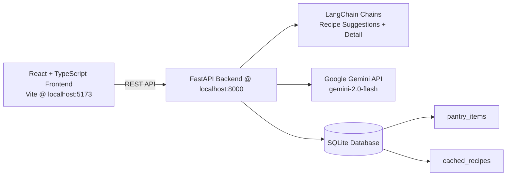

# Pantry_PAL (SmartPantry AI)

Pantry_PAL is an AI-powered kitchen assistant that helps you turn pantry ingredients into practical recipes, reduce food waste, and get step-by-step cooking guidance. The project now uses a **React + TypeScript frontend** and a **Python FastAPI + LangChain backend**.

## Architecture



## Tech Stack

- React
- TypeScript
- Tailwind CSS
- Python
- FastAPI
- LangChain
- Google Gemini
- SQLite
- SQLAlchemy
- Pydantic
- Vite

## How to run locally

### 1) Backend setup

```bash
cd backend
python -m venv .venv
source .venv/bin/activate
pip install -r requirements.txt
cp .env.example .env
# Edit .env and set GEMINI_API_KEY
uvicorn main:app --reload --host 0.0.0.0 --port 8000
```

### 2) Frontend setup

```bash
# from repo root
cp frontend/.env.example .env
npm install
npm run dev
```

The frontend reads `VITE_API_BASE_URL` from `.env` and defaults to `http://localhost:8000`.

## API Overview

- `GET /api/pantry`
- `POST /api/pantry`
- `DELETE /api/pantry/{item_id}`
- `DELETE /api/pantry`
- `POST /api/recipes/suggestions`
- `POST /api/recipes/detail`
- `POST /api/recipes/image`
- `POST /api/recipes/chat`
